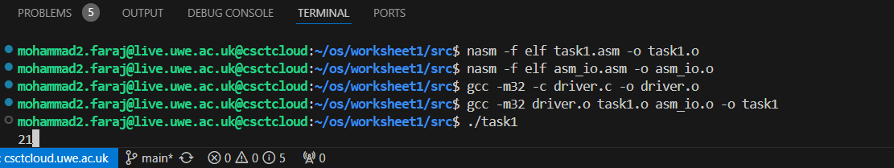
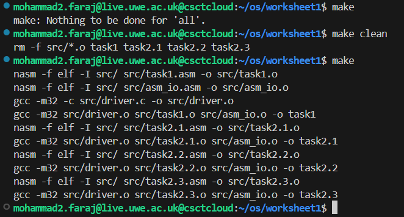

# Worksheet 1: An echo of Assembler

## Pre-task 1:

After connecting to the "csctcloud.uwe.ac.uk" remote server, I copied the assembly code for the assembly library, "asm_io.inc", and created a .asm file for it, "asm_io.asm", in the "src" folder, as ordered in the worksheet, which will be necessary for running my assembly code using C.

Also, I created a "driver.c" file in which I inserted the provided C code to run my assembly code by calling the asm_main function, which will be made in the assembly code using "global" later on.

In the x86 Assembly language, that I am using, there are some "General-purpose Registers" that I used in my code, where their functions are:

eax: used for arithmetic and stores the return value of functions
ebx: acts as a base register, often holding addresses or data that remain constant across operations
ecx: serves as the loop counter for repetitive operations, especially with the LOOP instruction
edi: used as the destination pointer for memory operations, particularly in data copying

Also, while using loops, some "Jump" instructions were used, where their functions are:

jmp: jumps unconditionally and moves execution directly to a specified label
je: jumps if the last comparison was equal (also known as "jump if equal")
jl: jumps if the last comparison indicated a value was less than another (signed comparison)
jg: jumps if the last comparison indicated a value was greater than another (signed comparison)

## Task 1:

To start, I created a "task1.asm" file in which I pasted the assembly code for adding two integers, 15 and 6.

First, the code calls the external file of the "asm_io.inc" library, which includes features I will need like the "print_int" command to print outputs. Then, in the "segment .data" section, it initializes two variables, integer1 and integer2, for the numbers that need to be summed. Also, I reserve space in memory for the variable "result" to store the result later in the "segment .bss" section.

In the "segment .text" section, I declared "asm_main" as a global label so that it can be called from the C program in the "driver.c" file, and started the main function using "asm_main:". Using "pusha" I saved all general-purpose registers, e.g., eax, and ebx, stored them into the stack, and preserved their values, ensuring that they were restored to their original states before the function returns.

Using the command "mov" I stored the value of "integer1" which is 15, in the register "eax", then using "add", "integer2" stored integer, 6, is added on the previous preserved value 15. Value in eax is then moved to the variable "result"; to store the answer "21" in it, and then displayed as an output to the user later by calling the "print_int" command from the "asm_io.inc" library.

Lastly, to return everything to its original state, I used "popa" to restore all registers from the stack, and return them to their original state, while the "mov eax, 0" command returns the value of "asm_main" to 0 after finishing executing.

To run the code, I needed to use "nasm" to assemble the assembly code into a machine code, also used other git commands like:
-f elf: to specify the output format as executable and linkable format, "elf".
-o "filename".o: to make the file an object that contains machine code, that will be linked later to create the executable.
gcc: to use the C compiler.
-m32: compiles the code to produce a 32-bit object file.
-c: to make the gcc compile only, not link, so that it produces an object file instead of an executable.

This way, I used this sequence of commands to create object files for the task1.asm, asm_io.asm, and driver.c files:
nasm -f elf task1.asm -o task1.o
nasm -f elf asm_io.asm -o asm_io.o
gcc -m32 -c driver.c -o driver.o

Then used this command to link together the object files previously made to form the final executable and call it "task1"
gcc -m32 driver.o task1.o asm_io.o -o task1

In the end, now whenever I want to run the code, I simply type the command "./task1", and the output "21" will just come out.

## Task 2:

### Task 2.1:

I created a "task2.1.asm" file to write the code in it and followed the same steps I did in the previous task to run the code. Thus, in this section, I will explain the logic of the Assembly code and show the program's outputs.

The main idea of the program is to print a welcome message to the user and then ask him about his name and the number of times he wants the welcome message to be displayed. The number must be between 50 and 100. Thus, some error handling techniques are used to print an error message if the number is wrong, and the user is asked again to re-enter the number.

In the "segment .data" section, I initialized some messages to be printed later as strings using the "nummsg db, 0" command. These messages include the "user name" and "number between 50 and 100" input questions, as well as the "welcome" and "error" messages. I also used the "newline db 0xA, 0" command to print a new line character.

In the "segment .bss" section, I initialized two variables, "num" and "name", for reserving 100 bytes of space in the memory, to store the user's name in, and a double word to store the user input number.

In the "segment .text" section, I declared "asm_main" as a global variable, started the "asm_main" function with "pusha", and ended the program with "popa" and "mov eax, 0". All these were explained in the previous task1, so I am just going to start talking about the main code inside the "asm_main" function.

Let's divide the code into the following sections:
1- Display and Read user's Name.
2- Input Number.
3- Validate Input Number.
4- Print Welcome Message.
5- Error Handling.
6- End program.
7- Read Loop.
8- Finish Reading.

In the Display and Read user's Name section, I loaded the "namemsg" into the eax register, then called the "print_string" function to print the message that asks for the user's name. Then I loaded the "name" variable into the eax register, to prepare it for reading the name before I call the "read_name" function -which will be discussed later- that shall read the input character by character and store it into the space reserved by the "name" variable.

In the Input Number section, I displayed the "nummsg" to the user after loading it into eax and calling the "print_string" function. Then I pretty did the same thing I did with the name before, I called the "read_int" function to iterate through the digits and read the number entered digit by digit, then used the "mov [num], eax" to store the input number from "eax" into "num".

In the Validate Input Number section, the code checks if the number is valid or not. First, it takes the number from the "num" variable and loads it into the "eax" register, and then it compares the number with "50", if the input is smaller than 50, it jumps to the "too_small" label. Then it compares the number with "100", if the number is greater than 100, it jumps to the "too_large" label.

In the Print Welcome Message section, it sets the "ecx" register to the number, then using the "print_loop" function, it starts a loop for printing the welcome message. In the loop, the "welcomemsg" string is loaded into the "eax" register and printed using the "print_string" function, then it loads the user's name from memory into eax and then prints the name next to the welcome message. The same approach is used for printing a "newline". Before the loop ends, using the command "loop print_loop", the program reduces the number stored in ecx by one, then repeats the loop if ecx is not equal to 0.

In the Error Handling section, after printing the welcome message the program jumps to the end of the program skipping any additional unnecessary code. While a "too_small" chunk of code starts for handling numbers less than 50, by printing an error message, and then it prints a newline character, and then it jumps back to the "input_number" section, so that the user enters a new number. There is a "too_large" section also, that shall deal with numbers greater than 100 using the same way used before with the "too_small" section.

The End Program section has been discussed before in task1, so no need to explain it again, it just simply restores everything to its initial state, and the "ret" command returns control to the operating system.

Now, the "read_name" is another function than the "asm_main" function, and it is made to iterate through the entered name by the user and read it character by character. It is initialized the same way the main function has been initialized except that it is not declared as "global" since it shall be called in the "asm_main" function, not by the C driver code. The "read_name" function also sets the register ecx to 0, to serve as an index while iterating through the name.

In the Read Loop section, the loop starts with calling the "read_char" function which is present in the "asm_io.inc" library to read a single character from the user input. The "cmp al, 0xA" command just simply checks if the user has entered a newline or not, where "al" is the lower 8 bits of the eax register, and "0xA" is the hexadecimal for 10 that is the ASCII code for the newline character. If a newline is detected, it jumps to the "done_reading" label to finish reading, if not the loop continues. The command "mov [name + ecx], al" is used to store the read character in the "name" variable at the index specified by ecx. Then "inc ecx" increments the index to prepare for the next character, and the loop continues using "jmp read_loop".

Lastly, in the Finish Reading section, a null terminator is added to the end of the "name" string to mark its end, the "popa" restores the saved registers from the stack, and "ret" returns control to the calling function.

### Task 2.2:

In this task I was asked to write a program that can sum all the digits between 1 and 100 together, and print the answer to the user, I used the same methods to make such a program I used in previous tasks, I created a "task2.2" file and included the "asm_io.inc" library in it, where everything is done in the "asm_main" function that shall be called and ran by the C code in the "driver.c" file.

In the "Segment .data" section, I initialized the string of the "sum_msg" and the "newline" character to be used later.

Then I initialized an array with the size of 100 DWORDs, in which I will store all digits between 1 and 100, and a variable that shall store the answer called "sum" in the "segment .bss" section.

In the "segment .text" section, I created the "asm_main" function and indicated it as global, and ran the push command to save the current state of all registers on the stack, then I started to code.

First, I started initialising the array by setting the ecx register to 1 as the starting number of the array and then pointing to the beginning of the array in memory. After that I started a loop "initialize_array", and then used the "cmp" command to compare between 101 and ecx -simply just checking if ecx has reached 101 if the index has reached 101, the program jumps then to the "sum_array" label to start summing, if not the current value of ecx is stored in the array using "mov [edi], ecx", and then increments ecx for the next integer and moves edi to the next 4-byte space (next array position), and then the loop repeats all over again until the array is filled with values 1 through 100.

Before summing the array, I needed to clear eax where the running sum will be stored and set ecx to 100 -for 100 iterations- and point to the start of the array using edi. In the "sum_loop", the value in the index of the array -edi- is added to eax, then edi is moved by 4 bytes -the size of an integer- to the next array element, and then decreases ecx by 1; if it is not equal to zero, the loop repeats.

In the end, the value of eax is then stored in the variable "sum", and the "sum_msg", The sum of the array is: , is printed and displayed to the user, after it the value stored in "sum" -5050- is also then printed after it, and a "newline" character is printed at last.

The program is then ended, and everything is returned to 0.

### Task 2.3:

The function of this program is to ask the user to enter a range of two numbers, where all the numbers between these two digits will be added, and then the answer shall be displayed to the user. The digits can not be less than 1, or more than 100.

After including the library, and initializing the string messages I want to print, I reserved a space in memory for an array, in which digits from 1 through 100 will be placed, and a sum variable to store the result, with two variables for a lower bound -to store the smallest number in- and an upper bound -to store the biggest number in, in "segment .bss".

After also initialising the "asm_main" function as global, and pushing all registers onto the stack to preserve their current state using pusha, in the "segment .text", the code started.

First, to initialize the array with the digits 1 through 100, I used ecx as an index and initialize it with 1, and loaded the address of the array into the edi register. Then, starts a loop, where it first checks if ecx equals 101, aka greater than 100, if so, it exits the loop and goes to the next part of the code, if not, it stores the value of ecx in the array before incrementing ecx with 1, and then moves edi with 4 bytes to the next place on the array, then it repeats the loop.

Now, to read the range entered by the user, first in the "prompt_range" section, the range message shall be moved to eax then the "print_string" function is called to display the message and ask the user to enter two integers between 1 and 100, separated by a space or a new line. Then, the "read_int" function is called to take the first number and put it in eax, where it is then moved to the variable "lower_bound" to be stored inside it. The same is done with the "upper_bound" number.

To check if the range is valid is between 1 - 100, the "lower_bound" is compared to 1, so that if it is less than 1, the program jumps using "jl" to the "error_msg" section to display an error message to the user, then if the "lower_bound" is valid, the program checks if the "upper_bound" is more than 100, where if it is true the program jumps to the error message section. Lastly, the program compares the two bounds together, to see if the "lower_bound" is more than the "upper_bound", if so, it jumps to error, if not it continues.

For summing the range then, first, the register eax needs to be cleared and set to 0, where the operator "xor" is used to set it to 0 if eax is compared with itself. Then the "lower_bound" is loaded to the ecx register, where it will act as an index to the array loaded in edi. Then the "sum_loop" starts, where at the beginning ecx is compared to the "upper_bound" to check if it exceeds it and jumps then to the "display_sum" section if it is less than the upper bound, the line: add eax, [edi + (ecx - 1) * 4], is used to point to the place of the next integer in the array and add it to the sum stored in eax, where:
add eax, [...]: adds whatever in the brackets to eax.
array: is the base address where the array starts in memory.
ecx: the index.
ecx - 1: subtracts 1 from the index to match the zero-based indexing.
(...) * 4: gives the correct byte offset, because each integer in the array is 4 bytes long.
Lastly, increments ecx and repeats the loop.

To display the sum, store the value of the sum from eax into the variable "sum", then print the "sum_msg" before printing the sum and the "newline" character.

In the case of an error, an "invalid_range" function is used. It prints an "err_msg" to the user and then jumps to the "prompt_range" section so that the user enters a new range. At the end, restore the state of all registers and return 0.

## Task 3:

Now, instead of executing the "nasm" and "gcc" commands every time I apply a change to the code, the way they are explained in #task 1, I created a Makefile that will automatically run all these commands instead of me just by simply typing "make" in the terminal. Here, I will explain the structure of this Makefile.

The Makefile needs to execute commands that shall run task1 through task2.3, so  this needs commands for:
- making object files for the driver.c, asm_io.asm, as well as for each task.asm
- linking object files of the driver, asm_io, and the task together to create the executables
- making a default target that shall build all tasks at the same time
- making a clean target to delete all object files and executables that were made before

Default Target: all
It depends on tasks 1 through 2.3, and these are other targets defined later that each represents a separate executable. This builds all four tasks together when the "make" command is run.

Assembling with NASM
It builds an object file that depends on the source code .asm file, where it then uses the command of creating this object file, where:
-f elf: specifies the output format as ELF (Executable and Linkable Format)
-I src/: Setd the include directory for NASM as "src/", the files location
-o src/file.o: specifies the output file as an object file.o, located in the src directory
This is used to create all object files for asm_io.asm, task1-2.3.asm

Compiling with GCC
It compiles the driver.c into an object file driver.o using GCC, where:
-m32: compiles for a 32-bit enivronment
-c: tells GCC to compile the file into an object file without linking
-o src/driver.o: specifies driver.o as the output file

Linking Executables
Links object files for a task, driver, and asm_io together to create an executable.

Clean Target
It removes all object files and executables to clean up the directory, where:
rm -f src/*.o: deletes all object files in the src directory
rm -f task1 task2.1 task2.2 task2.3: Deletes all the compiled executables

